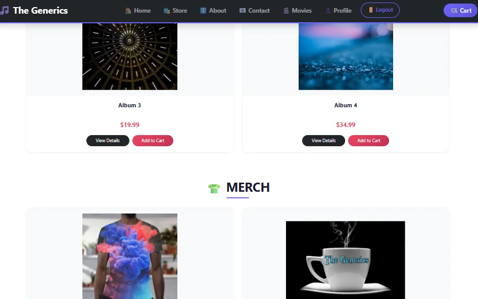
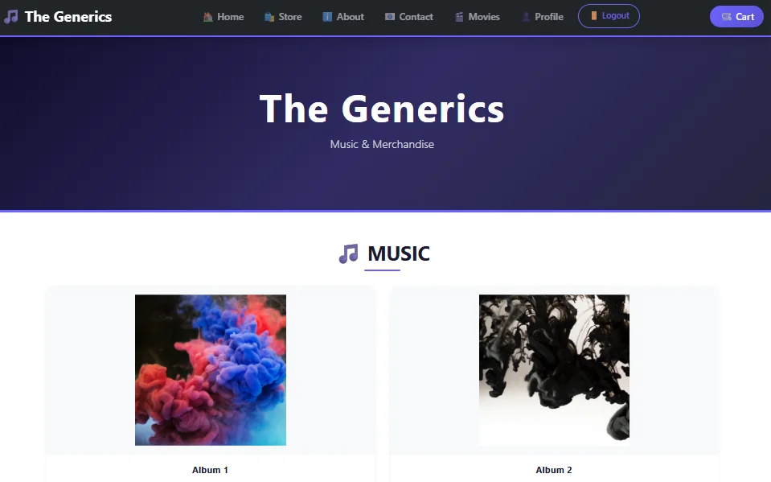
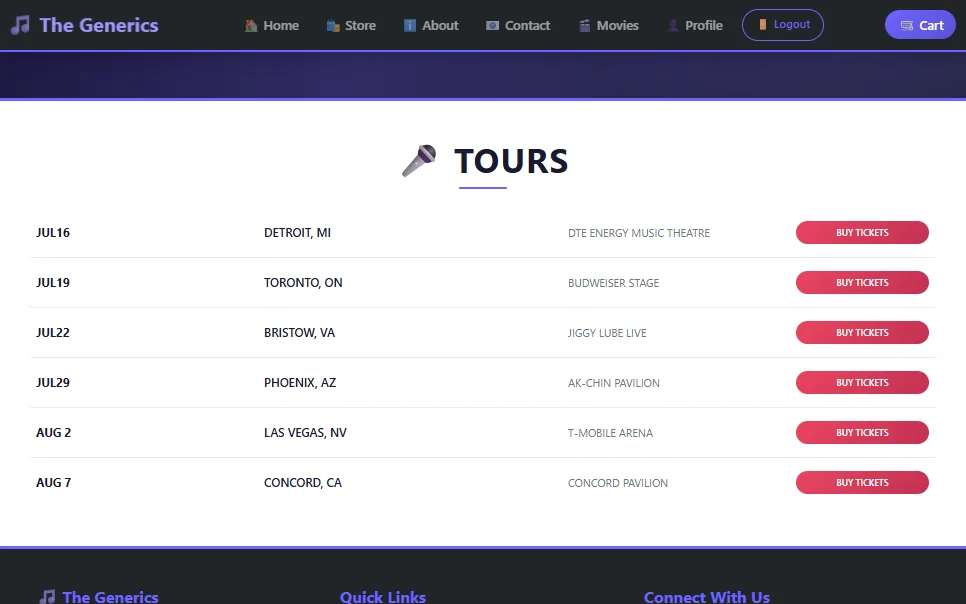

# E-Commerce Website – Online Music Store (The Generics)

A responsive online music store built with **React** and **Vite**. Users can browse albums and merchandise, open product details, add items to a cart and sign in. Authentication and data use **Firebase** through its **REST APIs**.

**Live Demo:** https://the-generics-music-store.vercel.app



## Features

- **11 pages** with React Router: Home, Store, Product Details, Cart, About, Contact, Movies, Login, Sign Up, Profile and Change Password
- **6 products** in 2 categories: 4 albums and 2 merchandise items
- Product list and product detail pages
- Cart with quantity updates and total price, saved per user in **localStorage** so it survives page reloads
- Notification when an item is added to or removed from the cart
- **Sign up, login and change password** with Firebase Authentication (REST API)
- **5 protected pages** (Products, Product Details, Cart, Profile, Change Password) for logged-in users only
- Automatic logout when the login token expires
- Cart and login state shared across the app using the **Context API**
- Movies page that loads data from **Firebase Realtime Database**, with automatic retry if loading fails
- Contact form that saves messages to Firebase Realtime Database
- Custom 404 page

## Tech Stack

React.js · JavaScript · Vite · Context API · React Router · React Bootstrap · Bootstrap · React Icons · Firebase Authentication (REST API) · Firebase Realtime Database

## Screenshots

| Store | Home |
|---|---|
|  |  |

## Run Locally

```bash
git clone https://github.com/VinayYadav07/the-generics-music-store.git
cd the-generics-music-store
npm install
```

Create a `.env` file in the project root:

```
VITE_FIREBASE_API_KEY=your_firebase_web_api_key
```

Then start the app:

```bash
npm run dev
```

Open http://localhost:5173.

## Author

**Vinay Kumar Yadav** – Frontend Developer
[Portfolio](https://portfolio-rho-red-54.vercel.app) · [LinkedIn](https://www.linkedin.com/in/vinay-yadav-593b53329) · [GitHub](https://github.com/VinayYadav07)
